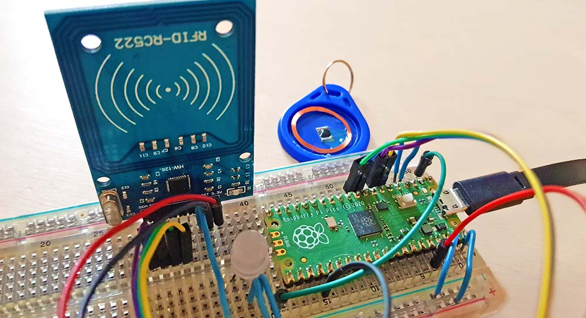
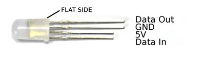

# circuitpython-rfid-hid

convert RFID Tag Data into keystrokes by emulating a USB Keyboard on a Pi Pico, including leave-events.
 It can read and write tag data, but currently only checks if the tag UID exists in a JSON file.

This Project could easily be used to build a Sound Toy that works similar to the popular Toniebox®.

## Hardware: 
- Raspberry Pi Pico (RP2040) with CircuitPython 7.x
- MFRC522-based RFID reader using SPI
- Mifare Classic 1k Tags (not sure if MFRC522 also supports different Standards..)
- optional LED: APA106 (WS2811) or any other NeoPixel (WS2812)

### RFID (MFRC522 Module)
RFID Class for [MFRC522](http://www.nxp.com/documents/data_sheet/MFRC522.pdf) is based on [domdfcoding/circuitpython-mfrc522](https://github.com/domdfcoding/circuitpython-mfrc522) (CircuitPython port),
 forked from [wendlers/micropython-mfrc522](https://github.com/wendlers/micropython-mfrc522) (MicroPython port).

| MFRC522   | Pico GPIO |
|-----------|-----------|
| sck       | GP06      |
| mosi      | GP07      |
| miso      | GP04      |
| rst       | GP18      |
| cs/sda    | GP05      |

###Write Access to Pico's internal memory
Write Access for Pico is enabled by grounding Pin GP02 to mass. This sets the USB-filesystem to *read-only*, allowing Pico to write to it's own memory. 
Handled by ``boot.py`` at boot time as described [here](https://learn.adafruit.com/circuitpython-essentials/circuitpython-storage).

| extra pins     | Pico GPIO |
|----------------|-----------|
| NeoPixel (PWM) | GP00      |
 | write Access   | GP02      |

### NeoPixel LED
APA106 LED  is driven by [Adafruit CircuitPython library](https://github.com/adafruit/Adafruit_CircuitPython_NeoPixel) as described [here](https://learn.adafruit.com/getting-started-with-raspberry-pi-pico-circuitpython/neopixel-leds)
and wired like this:

 [image source](https://www.espruino.com/WS2811)

###USB HID (Keyboard Emulation)
USB-HID utilizes [CircuitPython HID library](https://github.com/adafruit/Adafruit_CircuitPython_HID)
which can emulate Keyboard and Mouse as described [here](https://learn.adafruit.com/circuitpython-essentials/circuitpython-hid-keyboard-and-mouse) or [here](https://blog.thestaticturtle.fr/getting-started-with-hid-and-the-pi-pico/).

## Usage

Copy ``code.py``, ``boot.py``, ``known_tags.json`` and the ``lib/`` directory with all it's content (``mfrc.py`` class and adafruit libraries) to the root of Pico's File System.
